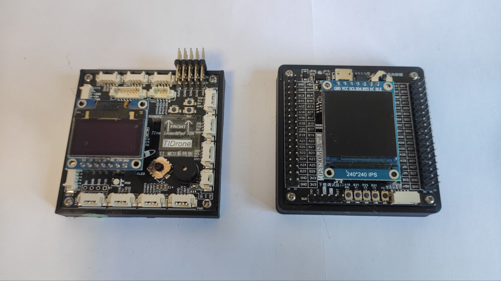

# MSPM0G3507核心板例程目录

[点击进入无名创新淘宝链接](https://item.taobao.com/item.htm?id=797439166014)

无名创新B站视频教程合集：https://www.bilibili.com/video/BV1Ei421Q7n9/

## [1、GPIO驱动板载灯闪烁](https://gitee.com/namelesstech/lp_mspm0g3507_mini_examples/tree/master/examples/1_empty_project_led)

## [2、软件模拟I2C驱动0.96寸OLED显示屏](https://gitee.com/namelesstech/lp_mspm0g3507_mini_examples/tree/master/examples/2_soft_i2c_oled)

## [3、硬件I2C驱动0.96寸OLED显示屏](https://gitee.com/namelesstech/lp_mspm0g3507_mini_examples/tree/master/examples/3_hardwave_i2c_oled)

## [4、串口数据发送](https://gitee.com/namelesstech/lp_mspm0g3507_mini_examples/tree/master/examples/4_uart_only_tx)

## [5、串口数据发送与中断回环发送](https://gitee.com/namelesstech/lp_mspm0g3507_mini_examples/tree/master/examples/5_uart_tx_rx_interupt)

## [6、定时器周期性中断](https://gitee.com/namelesstech/lp_mspm0g3507_mini_examples/tree/master/examples/6_timer_period)

## [7、定时器输出PWM](https://gitee.com/namelesstech/lp_mspm0g3507_mini_examples/tree/master/examples/7_timer_pwm)

## [8、滴答定时器实现微秒、毫秒、延时、测量周期](https://gitee.com/namelesstech/lp_mspm0g3507_mini_examples/tree/master/examples/8_systick_micros_millis_delay)

## [9、ADC电压采集](https://gitee.com/namelesstech/lp_mspm0g3507_mini_examples/tree/master/examples/9_adc_single_conversion)

## [10、按键检测](https://gitee.com/namelesstech/lp_mspm0g3507_mini_examples/tree/master/examples/10_keyscan)

## [11、GPIO外部中断](https://gitee.com/namelesstech/lp_mspm0g3507_mini_examples/tree/master/examples/11_gpio_input_inerrupt)

## [12、DAC电压输出](https://gitee.com/namelesstech/lp_mspm0g3507_mini_examples/tree/master/examples/12_opa_dac8_output)

## [13、硬件SPI+硬件I2C驱动0.96寸OLED显示屏](https://gitee.com/namelesstech/lp_mspm0g3507_mini_examples/tree/master/examples/13_hardwave_spi_oled)

## [14、利用GPIO外部中断实现正交编码脉冲采集](https://gitee.com/namelesstech/lp_mspm0g3507_mini_examples/tree/master/examples/14_encoder_speed_measure)

## [15、利用GPIO外部中断和滴答定时器计时实现PPM信号的采集](https://gitee.com/namelesstech/lp_mspm0g3507_mini_examples/tree/master/examples/15_ppm_remote_prase)

## [16、超声波传感器US100数据采集](https://gitee.com/namelesstech/lp_mspm0g3507_mini_examples/tree/master/examples/16_ultrasonic%20sensor_us100_read)

## [17、外部eeprom存储器at24c16的读写](https://gitee.com/namelesstech/lp_mspm0g3507_mini_examples/tree/master/examples/17_eeprom_at24c16_rw)

## [18、外部flash存储器w25q64的读写](https://gitee.com/namelesstech/lp_mspm0g3507_mini_examples/tree/master/examples/18_flash_w25q64_rw)

## [19、MPU6050加速度计陀螺仪数据读取](https://gitee.com/namelesstech/lp_mspm0g3507_mini_examples/tree/master/examples/19_mpu6050_read)

## [20、SPL06气压计传感器数据读取](https://gitee.com/namelesstech/lp_mspm0g3507_mini_examples/tree/master/examples/20_baro_spl06_read)

## [21、IST8310磁力计传感器数据读取](https://gitee.com/namelesstech/lp_mspm0g3507_mini_examples/tree/master/examples/21_compass_ist8310_read)

## [22、1.3英寸ST7789显示屏测试例程](https://gitee.com/namelesstech/lp_mspm0g3507_mini_examples/tree/master/examples/22_lcd_st7789_240x240_1_3inch)

## [23、1.8英寸ST7735显示屏测试例程](https://gitee.com/namelesstech/lp_mspm0g3507_mini_examples/tree/master/examples/23_lcd_st7735_128x160_1_8inch)

## [24、2.4英寸ILI9341显示屏测试例程](https://gitee.com/namelesstech/lp_mspm0g3507_mini_examples/tree/master/examples/24_lcd_ili9341_240x320_2_4inch)
